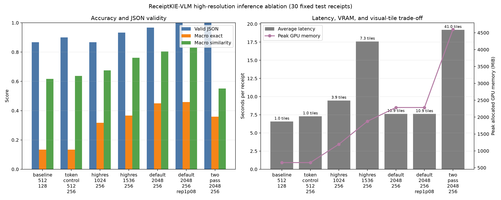

# High-Resolution Inference Ablation

## Verdict

On this fixed 30-receipt official-test subset, **image resolution is the primary
inference bottleneck; the 128-token cap is a smaller secondary bottleneck**.
Holding the token budget at 256, macro normalized exact match rises from 13.3%
at 512 pixels to 31.7% at 1024, 36.7% at 1536, and 45.0% at 2048. The evidence
supports validation-controlled high-resolution Iteration 2 training, but not a
change to the existing 100-receipt production claims.

These 30 receipts are an **inference-development ablation set**. They have now
informed resolution and generation experiments and therefore are not a final
untouched-test benchmark. Any checkpoint, decoding-policy, repetition-penalty,
or adaptive-retry selection for Iteration 2 must use validation receipts from
the official training split, not these 30 receipts.

The recommended inference configuration is:

- `image_longest_edge: 2048`
- `max_image_patch_edge: 512`
- `do_image_splitting: true`
- `max_new_tokens: 256`
- `repetition_penalty: 1.08`
- deterministic decoding with no sampling

This configuration has the best macro exact match (45.8%), macro similarity
(83.1%), JSON validity (100%), and repetition result (0 detected cases). The
unpenalized 2048 variant achieved the higher complete-record exact match, 10.0%
versus 6.7% for the always-penalized variant. Repetition penalty must therefore
be selected on validation data rather than adopted from this development
ablation.

## Experimental controls

- Adapter: the committed leakage-free LoRA under
  `models/receipt-kie-lora/`; it was not modified.
- Data: 30 receipts selected deterministically from the untouched official test
  split with seed 42.
- IDs: `artifacts/experiments/highres_ablation/test_ids.json`.
- Every variant uses the same IDs, model weights, prompt family, patch edge,
  image splitting, and deterministic decoding.
- No prediction was manually corrected.
- No training or 100-receipt production evaluation was run.

The requested matrix changes resolution and token budget together between the
512/128 baseline and 1024/256. A necessary additional
`token_control_512_256` variant was therefore run to isolate the effect of
generation length. This control uses the same single 512-pixel tile as the
baseline and differs only in `max_new_tokens`.

## Processor configuration and tile evidence

Processor loading now preserves published defaults unless a value is explicitly
configured. These settings are independently overrideable:

- `processor.image_processor.size`
- `processor.image_processor.max_image_size`
- `processor.image_processor.do_image_splitting`

Transformers 4.46.3 rejects its published 2048 longest-edge setting before the
splitting stage because an internal helper caps direct resizing at 1820. For
explicit edge overrides, the runner first applies the same LANCZOS
longest-edge resize and calls the processor with resizing disabled. A tensor
comparison confirmed that this path is bit-identical to the processor's native
512 behavior. The installed library is not patched.

The baseline log confirms:

```text
size={'longest_edge': 512}
max_image_size={'longest_edge': 512}
do_image_splitting=True
pixel_values_shape=[1, 1, 3, 512, 512]
```

Depending on receipt aspect ratio, observed tile counts were:

| Longest edge | Observed tiles per single pass | Average tiles |
|---:|---|---:|
| 512 | 1 | 1.00 |
| 1024 | 3 or 5 | 3.93 |
| 1536 | 4, 7, or 10 | 7.30 |
| 2048 | 9 or 13 | 10.87 |

Every tile has shape `[3, 512, 512]`. The two-pass strategy averages 41 total
tiles because it processes a top crop in Pass A and both the full image and
lower crop in Pass B.

## Results

| Variant | Valid JSON | Company EM | Address sim. | Date EM | Total EM | Complete EM | Macro EM | Macro sim. | Invalid | Limit hits | Repetition | Avg latency | Median | Peak allocated | Avg tiles |
|---|---:|---:|---:|---:|---:|---:|---:|---:|---:|---:|---:|---:|---:|---:|---:|
| `baseline_512_128` | 86.7% | 20.0% | 53.9% | 16.7% | 13.3% | 0.0% | 13.3% | 61.7% | 4 | 4 | 4 | 6.58 s | 6.80 s | 653.10 MiB | 1.00 |
| `token_control_512_256` | 90.0% | 20.0% | 54.9% | 16.7% | 13.3% | 0.0% | 13.3% | 63.7% | 3 | 3 | 4 | 7.30 s | 6.10 s | 653.10 MiB | 1.00 |
| `highres_1024_256` | 86.7% | 33.3% | 62.9% | 60.0% | 23.3% | 6.7% | 31.7% | 67.5% | 4 | 4 | 5 | 9.46 s | 8.16 s | 1,197.05 MiB | 3.93 |
| `highres_1536_256` | 93.3% | 33.3% | 78.2% | 63.3% | 33.3% | 6.7% | 36.7% | 76.1% | 2 | 2 | 2 | 17.59 s | 16.28 s | 1,876.30 MiB | 7.30 |
| `default_2048_256` | 96.7% | 36.7% | 81.5% | 73.3% | 53.3% | **10.0%** | 45.0% | 80.4% | 1 | 1 | 3 | 7.63 s | 7.04 s | 2,284.94 MiB | 10.87 |
| `default_2048_256_rep1p08` | **100.0%** | **40.0%** | **82.7%** | 76.7% | **53.3%** | 6.7% | **45.8%** | **83.1%** | **0** | **0** | **0** | 7.61 s | 6.87 s | 2,284.94 MiB | 10.87 |
| `two_pass_2048_256` | 100.0% | 16.7% | 28.8% | **83.3%** | 43.3% | 0.0% | 35.8% | 55.2% | 0 [1] | 0 | 1 | 19.20 s | 18.49 s | 4,597.83 MiB [2] | 41.00 |

[1] The two-pass strategy always serializes the deterministic merge as valid
four-field JSON. Nineteen of its 60 underlying model subpasses were invalid;
their corresponding fields were merged as empty strings, not corrected.

[2] PyTorch's peak allocated counter exceeded the GPU's nominal 4 GiB during the
multi-image pass under Windows WDDM, indicating shared/paged-memory pressure.
It should not be interpreted as 4,597.83 MiB of dedicated physical VRAM.



Machine-readable metrics and every raw prediction are under
`artifacts/experiments/highres_ablation/`.

## Answers to the ablation questions

### 1. Does increasing resolution improve company, date, and total extraction?

**Yes on this subset.** At the fixed 256-token budget, moving from the 512
control to 2048 raises company exact match from 20.0% to 36.7%, date from 16.7%
to 73.3%, and total from 13.3% to 53.3%. Address similarity rises from 54.9% to
81.5%. Macro exact match increases monotonically across 512, 1024, 1536, and
2048: 13.3%, 31.7%, 36.7%, and 45.0%.

### 2. Does increasing `max_new_tokens` reduce invalid JSON?

**Only slightly at fixed resolution.** The causal 512-pixel control reduces
invalid JSON from four to three and generation-limit hits from four to three,
but it does not improve company, date, total, complete-record, or macro exact
match. Macro similarity improves by only 2.0 percentage points. The 128-token
cap is therefore a real but secondary bottleneck.

### 3. Does a larger token budget increase or reduce repetition?

At fixed 512 resolution, repetition remains unchanged at four cases; more
tokens alone do not solve it. At 2048/256, a 1.08 repetition penalty reduces
detected repetition from three cases to zero, reduces invalid JSON from one to
zero, and does not increase average latency or VRAM materially.

The repetition detector is fixed before analysis: it flags any normalized
three- to six-token phrase that appears at least three times.

### 4. Does the two-pass crop strategy improve exact-match metrics?

**No overall.** It improves date exact match by 10.0 percentage points versus
single-pass 2048, but company falls by 20.0 points, total by 10.0 points,
complete-record exact by 10.0 points, and macro exact by 9.2 points. Address
similarity falls by 52.7 points. The top-crop prompt is out of distribution for
the current adapter: 19 subpasses are invalid. The strategy should not be used
for Iteration 2 without crop-aware training.

### 5. What is the accuracy, latency, and VRAM trade-off?

Relative to 512/128, the recommended 2048/256 + 1.08 penalty configuration:

- increases valid JSON by 13.3 percentage points;
- increases macro exact by 32.5 points and macro similarity by 21.4 points;
- increases company/date/total exact by 20.0/60.0/40.0 points;
- increases complete-record exact by 6.7 points;
- eliminates four invalid outputs, four limit hits, and four detected
  repetition failures;
- adds 1.03 seconds average generation latency (+15.6%);
- raises peak allocated GPU memory by 1,631.83 MiB, from 653.10 to
  2,284.94 MiB;
- increases average visual tiles from 1.0 to 10.87.

The 1536 result is slower than 2048 because its generated sequences are longer
on this subset; latency is output-dependent, not a monotonic proxy for image
resolution.

### 6. Which variant should be used for Iteration 2 training?

Use **2048 longest edge with 512-pixel splitting** as the target Iteration 2
data configuration, subject to a short forward/backward memory smoke test on
the 4 GiB GPU. Use 256 inference tokens and test the 1.08 repetition penalty
separately at evaluation time; repetition penalty is a decoding setting, not a
training hyperparameter.

If 2048 training does not fit with gradient checkpointing, 1536 is the fallback:
it retains most of the measured similarity improvement at lower inference
memory. Do not use the two-pass crop strategy without training on the same crop
and prompt distribution.

## Limitations

- This is a deterministic 30-receipt ablation, not the full 347-receipt test
  split and not a confidence-bounded benchmark.
- The subset is official test data and was not used for training, but repeated
  manual iteration against this subset would turn it into a development set.
- Results do not replace the tracked 100-receipt production evaluation or
  README claims.
- Generation latency measures `model.generate`, including vision-encoder work,
  but excludes image-file loading and CPU preprocessing.
- The repetition heuristic is transparent and reproducible but is not a human
  error taxonomy.
- High-resolution training is justified as the next controlled experiment, not
  as proof that a production system is ready.
