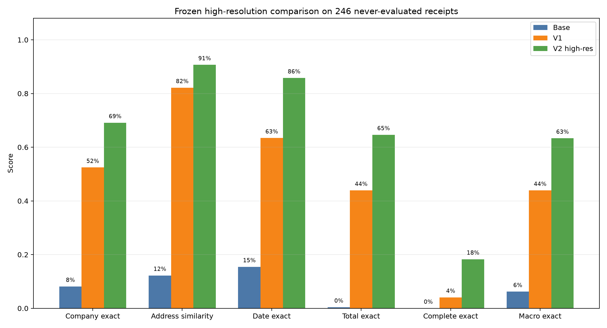
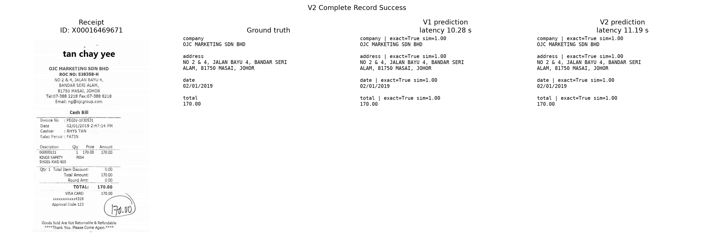
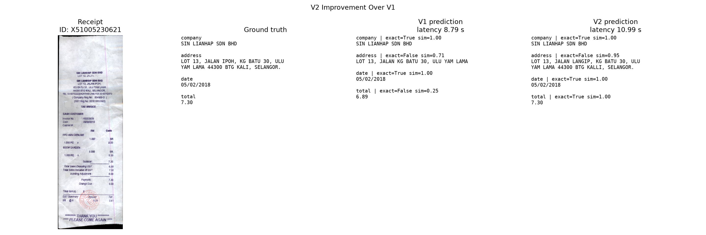
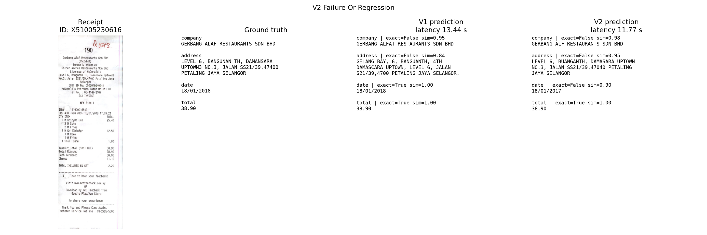

# High-Resolution Continued Training V2

## Decision

**Success gate: PASS.** V2 met the predeclared improvement threshold.

The final comparison uses every official-test receipt that was absent from all prior V1, robustness, qualitative, and inference-development artifacts. No holdout result was inspected before resolution, checkpoint, token budget, penalty policy, and parsing behavior were frozen on validation data.

## Test-data accounting

- Official-test receipts: 347.
- Pre-ablation evaluated receipts: 101.
- High-resolution inference-development receipts: 30; all 30 were already
  within the 101 previously evaluated receipts.
- Genuinely never-evaluated final holdout: 246.
- Final holdout ID-list SHA-256:
  `6071c91cefefd56efae5a10f13e55961e0c2d79ec9e76f5510b9cff3b08388e7`.

## Memory gate

| Resolution | Status | Peak allocated | Peak reserved | Seconds/step | Avg. tiles | Avg. assistant tokens | Final train / validation loss | Safe |
|---:|---|---:|---:|---:|---:|---:|---:|---|
| 2048 | success | 3943.08 MiB | 5890.00 MiB | 87.07 | 11.4 | 89.2 | 0.1737 / 0.231361 | False |
| 1536 | success | 3131.58 MiB | 4672.00 MiB | 24.78 | 7.9 | 89.2 | 0.1858 / 0.233579 | True |

2048 completed but exceeded the predeclared 3.7 GiB allocated-memory threshold. Full training therefore used 1536 without quantization.
Both smoke runs changed the LoRA tensors and passed saved-adapter reload verification.

## Training

- Source: committed V1 adapter `94ba0038153ea1aacb12dbcc80f1edf01d31a6309ea56919684e8cb8bbe90b28`.
- Exact split: 563 train / 63 validation receipts.
- Duration: 5062.12 seconds (84.37 minutes).
- Optimizer steps: 210.
- Peak allocated/reserved: 3174.26 / 4634.00 MiB.
- Validation loss: 0.213363 to 0.167716.
- Early stopping did not trigger because every validation-loss evaluation improved.

## Adapter integrity

| Adapter | Size | SHA-256 | Independent reload |
|---|---:|---|---|
| V1 production | 10,956,944 bytes | `94ba0038153ea1aacb12dbcc80f1edf01d31a6309ea56919684e8cb8bbe90b28` | PASS |
| V2 high-resolution recommended | 10,956,944 bytes | `3e0e5a88c36f0d6a0db6baf2a3b521e40be4ef84b212ed2eafecab431604bf79` | PASS |

## Frozen validation selection

- Checkpoint: `checkpoint-210`.
- Adapter SHA-256: `3e0e5a88c36f0d6a0db6baf2a3b521e40be4ef84b212ed2eafecab431604bf79`.
- Policy: `always_repetition_penalty_1p08`.
- Selection score: 0.630051.
- Formula: `0.35 * macro_normalized_exact_match + 0.2 * macro_normalized_similarity + 0.2 * complete_record_normalized_exact_match + 0.15 * valid_json_rate - 0.05 * generation_limit_rate - 0.05 * repetition_failure_rate`.
- Validation company exact / address similarity: 65.1% / 90.2%.
- Validation date exact / total exact: 95.2% / 73.0%.
- Validation macro exact/similarity: 67.9% / 91.1%.
- Validation complete exact / valid JSON: 30.2% / 100.0%.
- Validation generation-limit hits / repetition failures: 0 / 0.

## Final never-evaluated holdout

Holdout size: **246 receipts**.

| Variant | Valid JSON | Company | Address sim. | Date | Total | Complete | Macro exact | Macro sim. | Avg / median latency | Peak VRAM |
|---|---:|---:|---:|---:|---:|---:|---:|---:|---:|---:|
| BASE | 41.5% | 8.1% | 12.2% | 15.4% | 0.4% | 0.0% | 6.2% | 13.9% | 21.28 / 11.79 s | 1865.90 MiB |
| V1 | 98.4% | 52.4% | 82.2% | 63.4% | 43.9% | 4.1% | 43.9% | 80.1% | 9.95 / 10.27 s | 1876.55 MiB |
| V2 | 99.2% | 69.1% | 90.7% | 85.8% | 64.6% | 18.3% | 63.3% | 89.9% | 12.46 / 10.74 s | 1876.55 MiB |

### Bootstrap uncertainty

Percentile 95% confidence intervals use 2,000 receipt-level bootstrap resamples.

| Metric | V1 95% CI | V2 95% CI | Paired V2 - V1 (95% CI) |
|---|---:|---:|---:|
| Valid JSON | 96.75% to 99.59% | 97.97% to 100.00% | +0.81 pp (-1.22 to +2.85) |
| Company exact | 46.34% to 58.54% | 63.41% to 74.80% | +16.67 pp (+11.79 to +21.95) |
| Address similarity | 79.62% to 84.59% | 88.83% to 92.38% | +8.52 pp (+6.01 to +11.01) |
| Date exact | 57.32% to 69.51% | 81.30% to 89.84% | +22.36 pp (+16.67 to +28.05) |
| Total exact | 37.40% to 50.00% | 58.94% to 70.33% | +20.73 pp (+14.63 to +27.25) |
| Complete-record exact | 1.63% to 6.91% | 13.82% to 23.17% | +14.23 pp (+10.16 to +19.11) |
| Macro exact | 40.45% to 47.36% | 60.06% to 66.46% | +19.41 pp (+16.26 to +22.76) |

## Success gate

- Macro exact delta: +19.41 pp.
- Complete-record delta: +14.23 pp.
- Address-similarity delta: +8.52 pp.
- Valid-JSON delta: +0.81 pp.
- Gate result: **PASS**.

V2 passed release review and is the recommended adapter. V1 remains preserved
as the historical reproducible baseline.

## Qualitative panels

### V2 Complete Record Success

Sample `X00016469671` selected by the documented first-match rule.

### V2 Improvement Over V1

Sample `X51005230621` selected by the documented first-match rule.

### V2 Failure Or Regression

Sample `X51005230616` selected by the documented first-match rule.

## Limitations

- The experiment is specific to SROIE and a 256M-parameter VLM.
- Bootstrap intervals quantify sampling uncertainty, not dataset shift.
- Windows WDDM reserved-memory readings can exceed dedicated physical VRAM.
- Wall-clock inference included laptop GPU power-throttling intervals; use the
  medians alongside averages when comparing latency.
- The original V1 adapter, metrics, predictions, and historical claims remain
  preserved alongside the V2 release.

## Files created or modified

Modified:

- `.gitignore`
- `src/receipt_kie/collator.py`
- `src/receipt_kie/inference.py`
- `src/receipt_kie/model.py`

Created:

- `HIGH_RESOLUTION_TRAINING_V2.md`
- `configs/highres_training_smoke_1536.yaml`
- `configs/highres_training_smoke_2048.yaml`
- `configs/highres_training_v2.yaml`
- `configs/highres_training_v2_evaluation.yaml`
- `configs/highres_training_v2_holdout.yaml`
- `scripts/build_test_usage_manifest.py`
- `scripts/run_highres_training_smoke.py`
- `scripts/run_highres_training_v2.py`
- `scripts/run_highres_v2_holdout.py`
- `scripts/select_highres_v2_checkpoint.py`
- `src/receipt_kie/highres_training.py`
- `src/receipt_kie/test_usage.py`
- `src/receipt_kie/v2_evaluation.py`
- `src/receipt_kie/v2_final.py`
- `tests/test_highres_training.py`
- `tests/test_test_usage.py`
- `tests/test_v2_evaluation.py`
- `tests/test_v2_final.py`
- `models/receipt-kie-lora-v2-highres/adapter_config.json`
- `models/receipt-kie-lora-v2-highres/adapter_model.safetensors`
- `models/receipt-kie-lora-v2-highres/training_metadata.json`
- `artifacts/experiments/highres_training_v2/base_predictions.jsonl`
- `artifacts/experiments/highres_training_v2/final_holdout_ids.json`
- `artifacts/experiments/highres_training_v2/frozen_selection.json`
- `artifacts/experiments/highres_training_v2/qualitative_manifest.json`
- `artifacts/experiments/highres_training_v2/results.csv`
- `artifacts/experiments/highres_training_v2/results.json`
- `artifacts/experiments/highres_training_v2/smoke_1536.json`
- `artifacts/experiments/highres_training_v2/smoke_2048.json`
- `artifacts/experiments/highres_training_v2/test_usage_manifest.json`
- `artifacts/experiments/highres_training_v2/train_validation_manifest.json`
- `artifacts/experiments/highres_training_v2/training_summary.json`
- `artifacts/experiments/highres_training_v2/v1_predictions.jsonl`
- `artifacts/experiments/highres_training_v2/v2_predictions.jsonl`
- `artifacts/experiments/highres_training_v2/validation_results.json`
- `artifacts/experiments/highres_training_v2/validation_predictions/checkpoint-70/adaptive_retry_1p08.jsonl`
- `artifacts/experiments/highres_training_v2/validation_predictions/checkpoint-70/always_repetition_penalty_1p08.jsonl`
- `artifacts/experiments/highres_training_v2/validation_predictions/checkpoint-70/no_repetition_penalty.jsonl`
- `artifacts/experiments/highres_training_v2/validation_predictions/checkpoint-140/adaptive_retry_1p08.jsonl`
- `artifacts/experiments/highres_training_v2/validation_predictions/checkpoint-140/always_repetition_penalty_1p08.jsonl`
- `artifacts/experiments/highres_training_v2/validation_predictions/checkpoint-140/no_repetition_penalty.jsonl`
- `artifacts/experiments/highres_training_v2/validation_predictions/checkpoint-210/adaptive_retry_1p08.jsonl`
- `artifacts/experiments/highres_training_v2/validation_predictions/checkpoint-210/always_repetition_penalty_1p08.jsonl`
- `artifacts/experiments/highres_training_v2/validation_predictions/checkpoint-210/no_repetition_penalty.jsonl`
- `artifacts/figures/highres_training_v2_comparison.png`
- `artifacts/figures/highres_training_v2_qualitative/v2_complete_record_success.png`
- `artifacts/figures/highres_training_v2_qualitative/v2_failure_or_regression.png`
- `artifacts/figures/highres_training_v2_qualitative/v2_improvement_over_v1.png`
