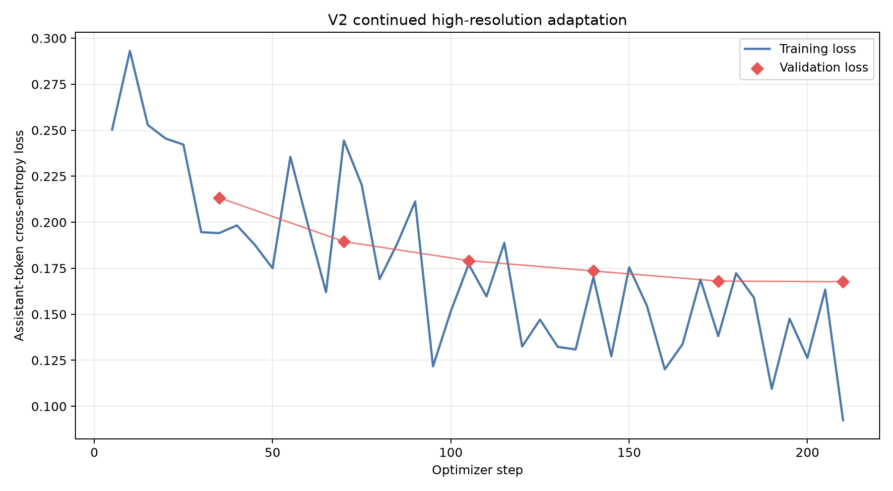

# ReceiptKIE-VLM Experiment Report

## Executive summary

ReceiptKIE-VLM is a reproducible structured key-information extraction project
for receipt images. It produces canonical JSON containing `company`, `address`,
`date`, and `total` using SmolVLM-256M-Instruct plus parameter-efficient LoRA.

The research progressed from a leakage-free 512 px baseline (V1), through a
controlled resolution ablation, to validation-selected 1536 px continued
adaptation (V2). High-resolution V2 continued adaptation achieved 99.2% valid
JSON, 69.1% company exact match, 90.7% address similarity, 85.8% date exact
match, 64.6% total exact match and 18.3% complete-record exact match on 246
previously unseen SROIE test receipts.

V2 is recommended within this repository, while V1 and all original results are
retained for historical reproducibility. Neither version is a production
financial extractor.

## Research question

Can a small open-weight VLM learn structured receipt extraction on a 4 GiB
consumer GPU, and does continued training at higher image resolution materially
improve an otherwise identical LoRA system?

## Data and leakage controls

The external SROIE mirror contains 626 official-train and 347 official-test
receipts. The training split is deterministically partitioned into 563 training
and 63 validation receipts. Both V1 and V2 use the same disjoint IDs and the
same four-field targets.

The test-usage audit found 101 test IDs used by historical evaluation,
robustness, qualitative selection, or the 30-receipt high-resolution
inference-development ablation. All 30 ablation IDs were already within those
101. The remaining 246 test IDs had never been evaluated and became the
one-time V2 release holdout. No holdout result influenced resolution,
checkpoint, generation, or parsing choices.

## Task and model

Input is a receipt image plus an instruction. The assistant target is:

```json
{"company":"value","address":"value","date":"value","total":"value"}
```

The collator masks system, user, image-placeholder, and padding tokens, leaving
loss only on assistant JSON tokens. Both adapters use rank-16 LoRA with alpha
32 and dropout 0.05 on `q_proj`, `k_proj`, `v_proj`, and `o_proj`.

The runtime used BF16 on an RTX 3050 Laptop GPU. The installed Idefics3 vision
tower rejected SDPA, so the loader logged the reason and used eager attention.
No quantization was required.

## Iteration 1: V1 baseline

V1 trained from a new LoRA initialization for two epochs and 140 optimizer steps
at a 512 px longest edge. It used deterministic generation with a 128-new-token
limit.

The retained 100-receipt historical results are:

| Metric | Base | V1 |
|---|---:|---:|
| Valid JSON | 19% | 85% |
| Company normalized exact | 1% | 26% |
| Address normalized similarity | 2.75% | 51.92% |
| Date normalized exact | 1% | 18% |
| Total normalized exact | 0% | 25% |
| Complete-record normalized exact | 0% | 0% |

These values remain useful as the original low-resolution baseline; they are
not mixed with the later 246-receipt V2 release holdout.

## Resolution ablation and memory gate

The 30-receipt development ablation found that 2048 px inference produced the
largest gains. It was explicitly not treated as final test evidence. Training
smoke tests then applied a predefined 3.7 GiB allocated-memory threshold:

| Resolution | Peak allocated | Seconds/step | Average tiles | Decision |
|---:|---:|---:|---:|---|
| 2048 px | 3,943 MiB | 87.07 | 11.4 | Unsafe |
| 1536 px | 3,132 MiB | 24.78 | 7.9 | Selected |

Both smoke runs completed, changed LoRA tensors, and reloaded their saved
adapters. The 2048 run exceeded the safety threshold, so full training used
1536 px rather than reducing data integrity or label masking.

## Iteration 2: V2 continued adaptation

V2 continued from the exact committed V1 adapter for three additional epochs:

| Setting | Value |
|---|---|
| Longest image edge | 1536 px |
| Maximum patch edge | 512 px |
| Image splitting | enabled |
| Train / validation IDs | same 563 / 63 as V1 |
| Optimizer steps | 210 |
| Learning rate | 5e-5 |
| Batch / accumulation | 1 / 8 |
| Duration | 5,062.12 s (84.37 min) |
| Peak allocated training VRAM | 3,174.26 MiB |

Validation loss decreased at every evaluation from 0.213363 at step 35 to
0.167716 at step 210. Early stopping therefore did not trigger.



## Validation-controlled selection

Checkpoints 70, 140, and 210 were evaluated on all 63 validation receipts under
three decoding policies. The frozen score combined macro exact, macro
similarity, complete-record exact, valid JSON, limit hits, and repetition
failures. Checkpoint 210 with deterministic 256-token generation and repetition
penalty 1.08 won before the unseen holdout was opened.

Selected validation metrics:

| Metric | Result |
|---|---:|
| Valid JSON | 100.0% |
| Company exact | 65.1% |
| Address similarity | 90.2% |
| Date exact | 95.2% |
| Total exact | 73.0% |
| Complete-record exact | 30.2% |
| Macro exact / similarity | 67.9% / 91.1% |

## Final unseen comparison

Base, V1, and V2 used identical 246 IDs, 1536 px processing, 512 px tiles,
image splitting, prompts, parser, 256-token budget, deterministic decoding, and
repetition penalty 1.08.

| Metric | Base | V1 | V2 | V2 − V1 |
|---|---:|---:|---:|---:|
| Valid JSON | 41.5% | 98.4% | **99.2%** | +0.8 pp |
| Company exact | 8.1% | 52.4% | **69.1%** | +16.7 pp |
| Address similarity | 12.2% | 82.2% | **90.7%** | +8.5 pp |
| Date exact | 15.4% | 63.4% | **85.8%** | +22.4 pp |
| Total exact | 0.4% | 43.9% | **64.6%** | +20.7 pp |
| Complete-record exact | 0.0% | 4.1% | **18.3%** | +14.2 pp |
| Macro exact | 6.2% | 43.9% | **63.3%** | +19.4 pp |

Address uses normalized similarity. Other reported field metrics use normalized
exact match. Complete-record exact requires all four normalized fields.

Paired 2,000-resample bootstrap intervals:

| V2 − V1 metric | Point change | 95% CI |
|---|---:|---:|
| Macro exact | +19.41 pp | +16.26 to +22.76 pp |
| Complete-record exact | +14.23 pp | +10.16 to +19.11 pp |
| Address similarity | +8.52 pp | +6.01 to +11.01 pp |
| Valid JSON | +0.81 pp | −1.22 to +2.85 pp |

The predefined release gate required a material gain in macro exact,
complete-record exact, or address similarity without more than a two-point
valid-JSON regression. V2 passed all three improvement thresholds and the
validity constraint.


## Latency, memory, and failures

V1 and V2 peak inference memory was approximately 1,877 MiB. V1 average/median
latency was 9.95/10.27 s; V2 was 12.46/10.74 s. Laptop power-throttling produced
wall-clock outliers, so medians should accompany averages.

The qualitative set uses the first holdout sample satisfying each documented
category rather than maximizing visual impact. It includes a complete success,
an improvement, and a date regression.


Complete-record exact remains 18.3%, and errors still occur in every field.
Results are specific to SROIE and do not establish reliability on private,
multilingual, or shifted receipt distributions.

## Reproducibility

The two adapters, predictions, split/test-usage manifests, seeded bootstrap
results, figures, and reports are tracked. Metrics recompute exactly from the
JSONL predictions. Raw SROIE data, caches, logs, virtual environments, and
intermediate checkpoints are not tracked.

See [`MODEL_COMPARISON.md`](MODEL_COMPARISON.md),
[`HIGH_RESOLUTION_ABLATION.md`](HIGH_RESOLUTION_ABLATION.md), and
[`HIGH_RESOLUTION_TRAINING_V2.md`](HIGH_RESOLUTION_TRAINING_V2.md).
