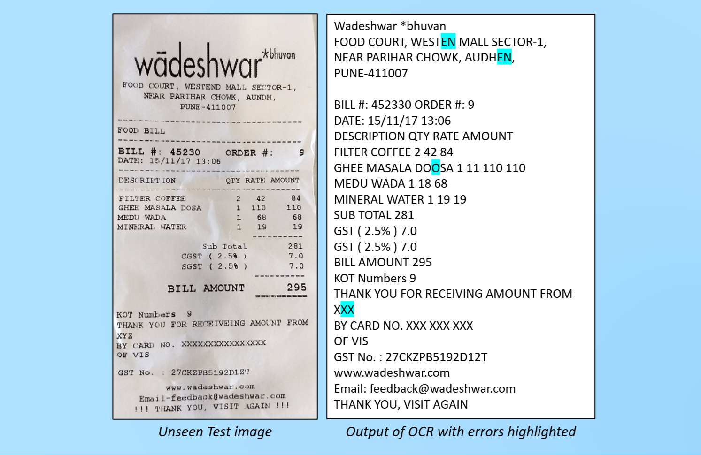
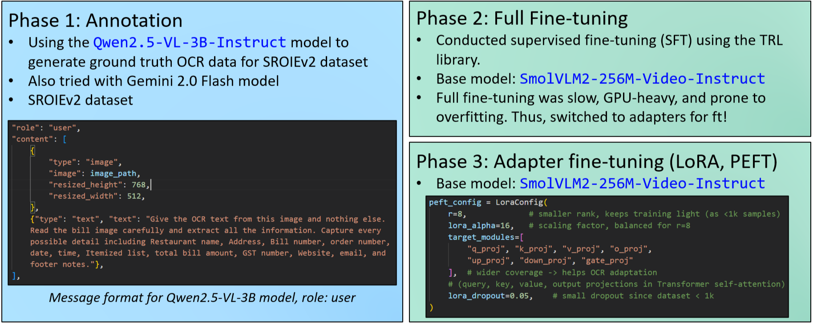

# Receipt OCR using Fine-tuned VLMs

- Generated high quality text annotations for receipt images using large VLMs such as **Qwen2.5-VL 3B** and **Gemini 2.0 Flash** as the annotators, which reduced annotation noise and enabled reliable training data for smaller models.
- Fine tuned **SmolVLM** using TRL with an `SFT_config` based training pipeline, training both adapter-based (using `LoRA`) fine-tuning and full fine-tuning variants on the SROIE v2 dataset, achieving a test CER of 0.313 compared to SROIE box texts.

## Local Environment Setup

The notebooks use Python 3.12 and the dependency versions recorded in
`requirements.txt`.

```powershell
python -m venv .venv
.\.venv\Scripts\Activate.ps1
python -m pip install --upgrade pip
python -m pip install -r requirements-dev.txt
```

On Windows with an NVIDIA GPU, replace the CPU-only PyTorch wheels with the
CUDA 12.4 builds:

```powershell
python -m pip install --no-deps -r requirements-gpu.txt
python -c "import torch; print(torch.__version__, torch.cuda.is_available(), torch.cuda.get_device_name(0))"
```

Start the notebooks from the activated environment:

```powershell
jupyter lab
```

## Setup Dataset

Download the SROIE v2 dataset from [urbikn/sroie-datasetv2](https://www.kaggle.com/datasets/urbikn/sroie-datasetv2).

Move it to the `input` directory so that the structure looks like this:

```
input/sroie_v2/
└── SROIE2019
    ├── test
    │   ├── box  [347 entries]
    │   ├── entities  [347 entries]
    │   └── img  [347 entries]
    └── train
        ├── box  [626 entries]
        ├── entities  [626 entries]
        └── img  [626 entries]
```
### About the SROIEv2 dataset
- The dataset has receipts written in English
- The dataset contains 973 scanned receipts split into train and test.
- For each receipt you have 
  - a `.jpg` image of the scanned receipt
  - a `.txt` file holding ground truth text and coordinates of respective boxes
  - and a `.txt` file holding the key entity information values (not used).

## Steps to Run


### Generating Annotations
- Prepare the text annotation files using the notebooks in `src/annot_notebooks` directory. 
- These generated text files will act as our ground truth to train the smaller VLMs. 
- Models available for generating annotations:
  - Qwen2.5-VL 3B (`qwen2_5_vl_3b_ocr.ipynb`)
  - Gemini 2.0 Flash (`gemini2_flash_ocr.ipynb`)
- The generated annotations will be saved in the `annots/<model_name>_annots` directory. 
- In case you are lazy, pre-generated annotations are available [here](https://www.kaggle.com/datasets/omkarsoak/vlm-receipt-ocr).

### Fine-tuning SmolVLM
Two types of fine-tuning are supported:
- Full fine-tuning (more resource intensive but better performance): `smolvlm_full_finetuning.ipynb`
- Adapter-based fine-tuning using `LoRA` (faster and less resource intensive): `smolvlm_lora.ipynb`

## Inference
- Use the `src/smolvlm_inference.ipynb` to run inference.

## Pre-trained Models
- Pretrained fully fine-tuned and adapter-based fine-tuned models are available for inference.

* The trained adapters are available with this GitHub repository (`notebooks/trained_models` directory).  
* The fully fine-tuned models are available here. You can just switch the `model_id` in the inference notebooks.

## Evaluation
- Two types of evaluation are supported:
  - Evaluation of the annotation creation models (Qwen2.5-VL 3B, Gemini 2.0 Flash) with the SROIE v2 box texts as ground truth.
  - Evaluation of the fine-tuned SmolVLM models with the qwen2.5-vl-3b generated annotations as ground truth.
- The evaluation metric used is Character Error Rate (CER).
- The evaluation notebooks are available in the `src/eval` directory.

#### Currently best performing annotation creation model is Qwen2.5-VL-3B
- Training data CER compared to the SROIE v2 box texts: **0.30**
- Test data CER compared to the SROIE v2 box texts: **0.33**
