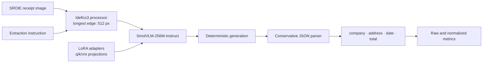
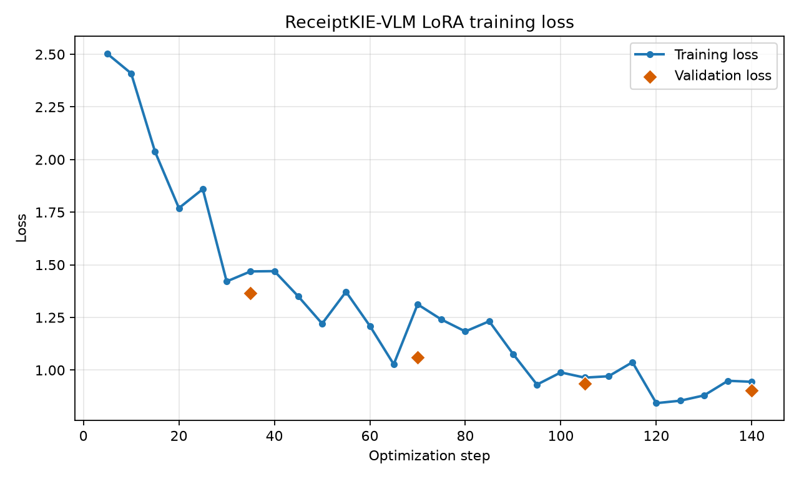
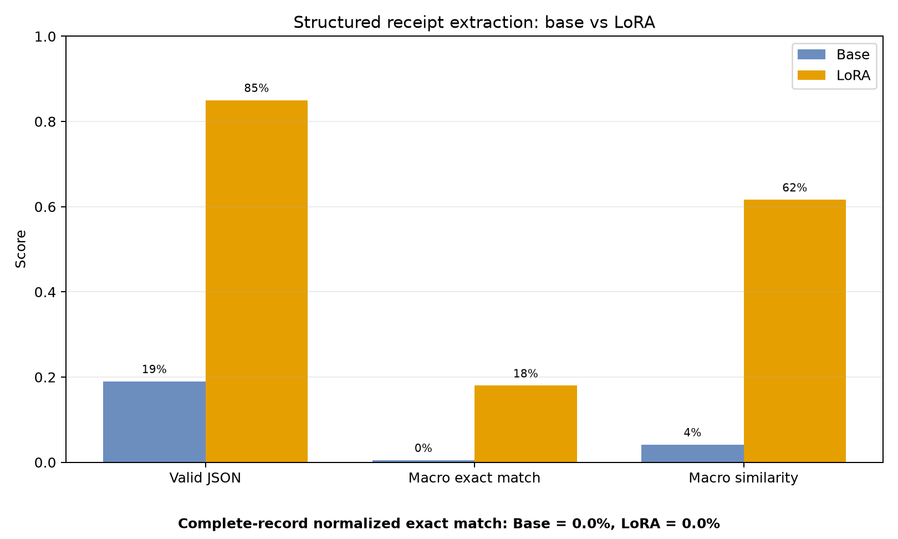
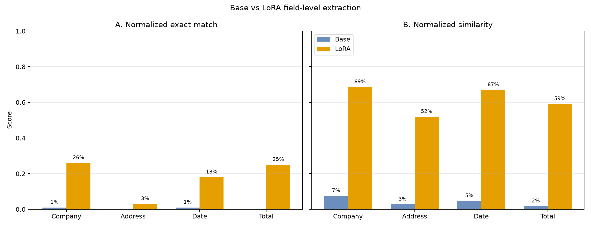
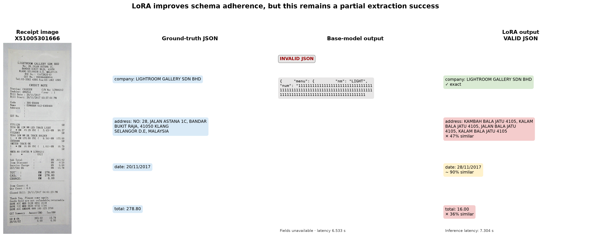
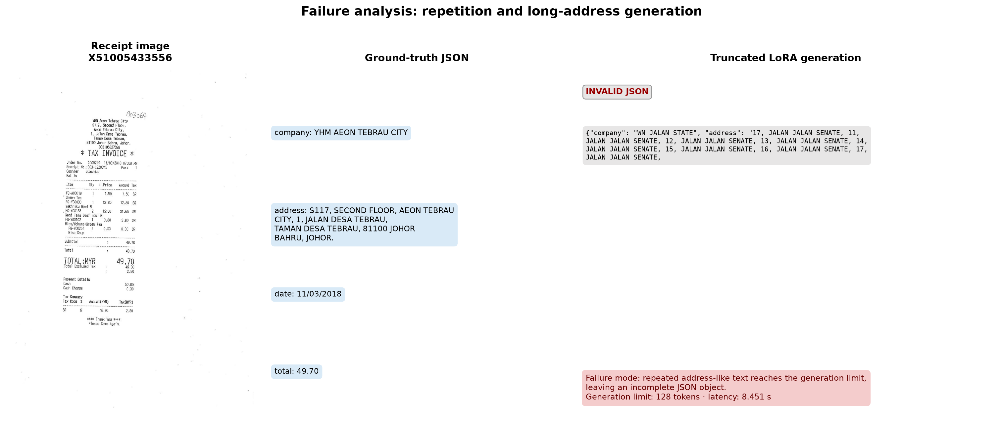
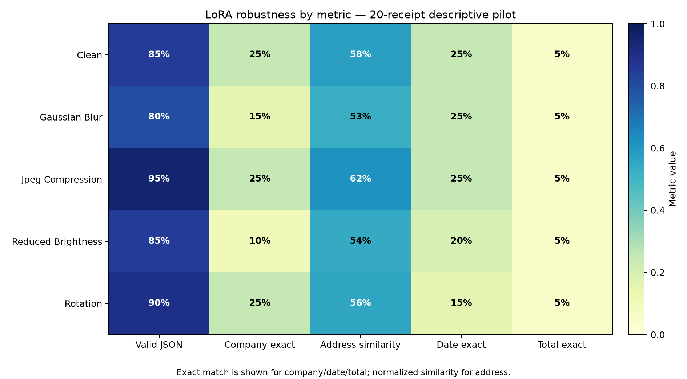

# ReceiptKIE-VLM

LoRA fine-tuning and evaluation of an open-weight vision-language model for
structured financial receipt understanding.

ReceiptKIE-VLM takes a receipt image and generates JSON with exactly four SROIE
entities:

```json
{"company":"...","address":"...","date":"...","total":"..."}
```

This repository contains a newly implemented structured-KIE pipeline, a newly
trained LoRA adapter, and evaluation artifacts produced locally from that adapter.
The final adapter is included under `models/receipt-kie-lora/`. It does not claim
that SmolVLM was trained from scratch.

## Clone and Run the Trained Model

```bash
git clone https://github.com/tusharg007/receipt-kie-vlm.git
cd receipt-kie-vlm
python -m venv .venv
```

Windows:

```powershell
.\.venv\Scripts\activate
```

Linux/macOS:

```bash
source .venv/bin/activate
```

Then install and run:

```bash
python -m pip install --upgrade pip
pip install -r requirements.txt
python scripts/verify_installation.py
python scripts/demo_inference.py
```

To use another image:

```bash
python scripts/demo_inference.py --image path/to/receipt.png
```

The trained LoRA adapter is stored directly in this repository. On first use,
the public `HuggingFaceTB/SmolVLM-256M-Instruct` base model and processor download
automatically, so internet access is required for that initial run. GPU inference
is recommended but optional; the demo falls back to CPU. Inference uses the
fictional image in `assets/demo/` and requires neither SROIE nor a Kaggle account.
Training and evaluation require the separately obtained SROIE dataset.
`assets/demo/expected_output.json` documents the fictional text rendered in the
image; it is not a promise that this small research model predicts every field
exactly.

## Problem statement

Conventional receipt OCR returns an undifferentiated stream of text. Applications
usually need named values: the merchant, address, transaction date, and amount.
ReceiptKIE-VLM formulates that task as multimodal supervised fine-tuning (SFT):
the model sees the image and extraction instruction, then learns to generate one
canonical JSON object. This combines visual reading, field selection, and
serialization in one model while retaining auditable raw predictions.

## Architecture



The base model is
[`HuggingFaceTB/SmolVLM-256M-Instruct`](https://huggingface.co/HuggingFaceTB/SmolVLM-256M-Instruct).
PEFT LoRA updates only attention projection adapters; the base weights remain
frozen.

## Dataset and audit

The experiment uses SROIE2019 entity annotations from the public
[`urbikn/sroie-datasetv2`](https://www.kaggle.com/datasets/urbikn/sroie-datasetv2)
mirror. SROIE is an external dataset and is not owned by this project. Raw data is
Git-ignored.

| Audit item | Result |
|---|---:|
| Valid image/entity pairs | 973 |
| Training receipts | 626 |
| Test receipts | 347 |
| Missing/invalid pairs excluded | 0 |
| Empty address values | 1 |
| Empty total values | 1 |
| Image width range | 435–4,961 px |
| Image height range | 605–7,016 px |

The complete audit, including field frequencies and dimension statistics, is in
[`artifacts/reports/dataset_audit.md`](artifacts/reports/dataset_audit.md).

Targets preserve annotation values as strings and use stable key order, UTF-8,
compact separators, and `""` for missing values. No OCR transcription generated
by another model is used as the KIE target.

## Multimodal SFT and label masking

Each sample uses the processor's native chat template:

- System: define the receipt-extraction role.
- User: one receipt image plus an instruction to emit JSON only.
- Assistant: canonical ground-truth JSON.

The collator processes the prompt and full conversation separately, finds their
token prefix boundary, and masks prompt, padding, and image placeholder tokens
with `-100`. Loss therefore applies only to assistant answer tokens. The real-model
smoke test observed 146 prompt tokens and 91–98 assistant tokens, well below the
configured 512-token sequence limit; image tokens were not truncated.

## LoRA configuration

LoRA adds low-rank trainable matrices to `q_proj`, `k_proj`, `v_proj`, and
`o_proj`. Valid module suffixes are discovered from the loaded architecture before
attachment rather than assumed blindly.

| Setting | Value |
|---|---|
| Base model | SmolVLM-256M-Instruct |
| LoRA rank / alpha / dropout | 16 / 32 / 0.05 |
| Trainable parameters | 2,727,936 |
| Trainable share | 1.052% |
| Total parameters with adapters | 259,212,864 |
| Estimated FP32 adapter size | 10.41 MiB |

## Hardware and training

| Setting | Value |
|---|---|
| GPU | NVIDIA GeForce RTX 3050 Laptop GPU, 4 GiB |
| PyTorch / CUDA | 2.5.1+cu124 / CUDA 12.4 |
| Precision | BF16 |
| Attention | Eager fallback; this Idefics3 vision tower rejected SDPA |
| Image size | Processor-supported 512 px longest edge |
| Batch / accumulation | 1 / 8 |
| Epochs / optimizer steps | 2 / 140 |
| Learning rate / warmup | 2e-4 / 5% |
| Training receipts | 563 from the official train split |
| Validation-loss receipts | 63 disjoint receipts from the official train split |
| Final evaluation receipts | 100 sampled only from the official test split |
| Seed | 42 |
| Duration | 1,084.19 s (18.07 min) |
| Peak allocated training VRAM | 827.32 MiB |

Validation loss decreased from **1.3650** at step 35 to **1.0618** at step 70,
**0.9373** at step 105, and **0.9034** at the completed step 140. Training and
validation IDs are stored in the generated split manifest with zero overlap.
The official test split was not used for model selection. The saved checksum
confirms at least one LoRA tensor changed from its fresh initialization.



## Base versus LoRA results

Both variants used the same fixed 100-receipt subset sampled from the untouched
official test split, with the same prompt, 512 px image processing,
deterministic decoding, and 128-new-token limit.

| Metric | Base | LoRA | Absolute change |
|---|---:|---:|---:|
| Valid JSON | 19% | **85%** | +66 pp |
| Company normalized exact match | 1% | **26%** | +25 pp |
| Address normalized similarity | 2.75% | **51.92%** | +49.17 pp |
| Date normalized exact match | 1% | **18%** | +17 pp |
| Total normalized exact match | 0% | **25%** | +25 pp |
| Complete-record normalized exact match | 0% | 0% | 0 pp |
| Average latency | 5.895 s | 7.640 s | +1.745 s |
| Median latency | 5.458 s | 7.440 s | +1.982 s |
| Peak allocated inference VRAM | 642.70 MiB | 653.17 MiB | +10.47 MiB |

Raw versus normalized field metrics are retained in
[`base_metrics.json`](artifacts/reports/base_metrics.json),
[`lora_metrics.json`](artifacts/reports/lora_metrics.json), and
[`model_comparison.csv`](artifacts/reports/model_comparison.csv).





## Qualitative Results



LoRA substantially improves schema adherence and JSON validity. The highlighted
example is deliberately labelled a **partial success**: at least one normalized
field is exact, but the receipt is not fully correct.



The failure panel keeps the raw generation visible. Repetition and long-address
generation can consume the 128-token budget and leave an incomplete JSON object.
The exact source IDs and unedited prediction values used in both figures are
recorded in
[`qualitative_results_manifest.json`](artifacts/reports/qualitative_results_manifest.json).
All predictions remain available as JSONL under `artifacts/predictions/`.

## Failure analysis

- No test receipt had all four normalized fields exactly correct. The model is a
  research prototype, not a production extractor.
- Fifteen LoRA generations were invalid JSON. Inspection shows long repeated
  address-like text reaching the generation cap rather than a parser defect.
- Address is the hardest exact-match field because it is long and sensitive to
  small OCR substitutions, ordering, and punctuation. Similarity improves
  substantially even while exact match remains 3%.
- The adapter is slower than base because its outputs are more structured but
  often longer.
- The 256M model and 512 px downscaling trade fine-print recognition for local
  training feasibility.

## Pilot robustness benchmark

A paired 20-receipt pilot evaluated the LoRA model on clean images and four mild
deterministic corruptions. Because this is a small subset, differences are
descriptive rather than statistically definitive.

| Condition | Valid JSON | Company acc. | Address sim. | Date acc. | Total acc. |
|---|---:|---:|---:|---:|---:|
| Clean | 85% | 25% | 57.51% | 25% | 5% |
| Gaussian blur (radius 1.2) | 80% | 15% | 52.60% | 25% | 5% |
| JPEG quality 45 | 95% | 25% | 61.53% | 25% | 5% |
| Brightness 0.65× | 85% | 10% | 53.69% | 20% | 5% |
| Rotation up to ±3° | 90% | 25% | 55.81% | 15% | 5% |



## Reproduction

Python 3.11 or newer is supported. An NVIDIA CUDA environment is recommended on Windows for faster inference and training, but the demo also runs on CPU.

```powershell
python -m venv .venv
.\.venv\Scripts\python.exe -m pip install --upgrade pip
.\.venv\Scripts\python.exe -m pip install -r requirements-dev.txt
.\.venv\Scripts\python.exe -m pip install --no-deps -r requirements-gpu.txt
.\.venv\Scripts\python.exe scripts\preflight.py
```

Place SROIE2019 under `data/raw/sroie/SROIE2019`, then audit, smoke-test, train,
and evaluate:

```powershell
.\.venv\Scripts\python.exe scripts\prepare_dataset.py
.\.venv\Scripts\python.exe -m pytest -q
.\.venv\Scripts\ruff.exe check src\receipt_kie scripts tests
.\.venv\Scripts\python.exe scripts\run_smoke_test.py
.\.venv\Scripts\python.exe scripts\run_training.py --config configs\train_lora.yaml
.\.venv\Scripts\python.exe scripts\run_evaluation.py --config configs\evaluate.yaml
.\.venv\Scripts\python.exe scripts\run_robustness.py --config configs\evaluate.yaml
.\.venv\Scripts\python.exe scripts\build_report.py
```

The base model downloads into `.cache/huggingface/`. Exact successful environment
versions are recorded in `requirements-lock.txt`. The default demo does not read
the dataset or any training checkpoint.

## Repository structure

```text
configs/                    Reproducible train/evaluation settings
src/receipt_kie/            Dataset, prompting, model, training, inference, metrics
scripts/                    Preflight, audit, train, evaluate, report, integrity CLIs
tests/                      Focused unit tests
research_notebooks/         Preserved upstream research notebooks
data/                       Git-ignored raw and derived datasets
models/receipt-kie-lora/    Committed minimal LoRA inference adapter
artifacts/
  checkpoints/              Local trainer state and intermediate checkpoints (Git-ignored)
  figures/                  Generated plots
  predictions/              Auditable JSONL and curated receipt examples
  reports/                  Audits, metrics, comparisons, integrity check
```

## Ethical and data-use considerations

Receipts can contain sensitive financial or location information. Use only data
whose licence and consent permit the intended processing; avoid uploading raw
private receipts; restrict access to prediction artifacts; and evaluate across
languages, layouts, scan quality, and merchant types before any consequential
use. Generated values can be wrong and should not drive payment, accounting, or
compliance decisions without validation.

## Acknowledgement and licence

Selected SmolVLM processor, fine-tuning, and LoRA ideas were adapted from the
original MIT-licensed receipt-OCR repository by Omkar Oak. The legacy notebooks
are preserved in `research_notebooks/`. This work does not claim authorship of
SmolVLM or SROIE.

The original [MIT licence](LICENSE) and copyright notice are preserved.
